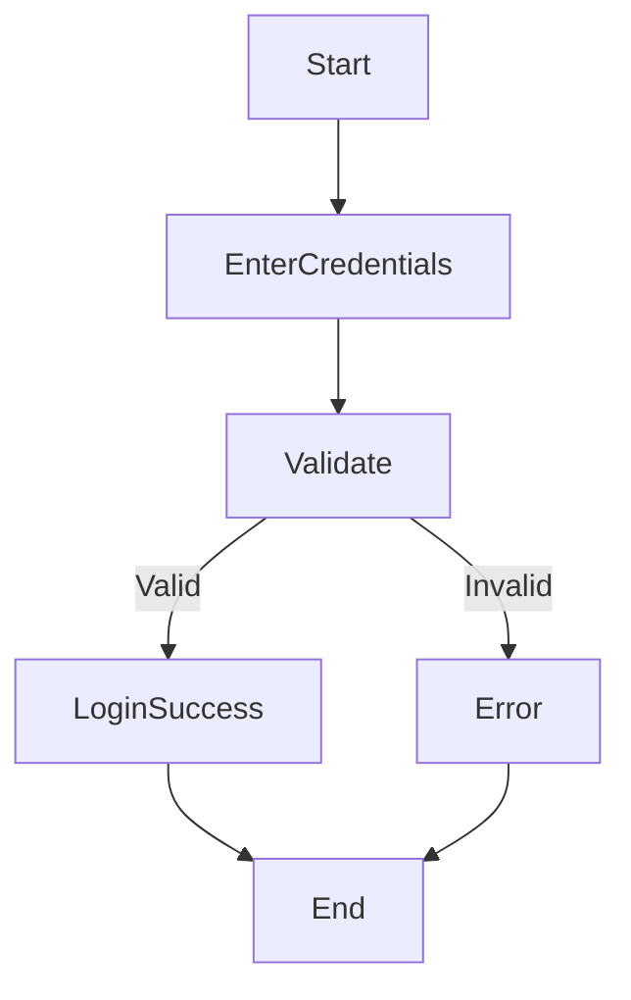
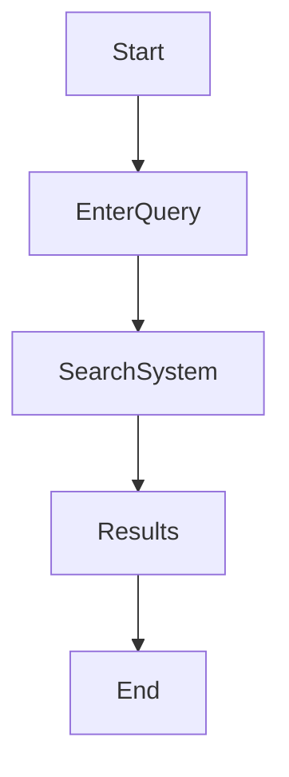
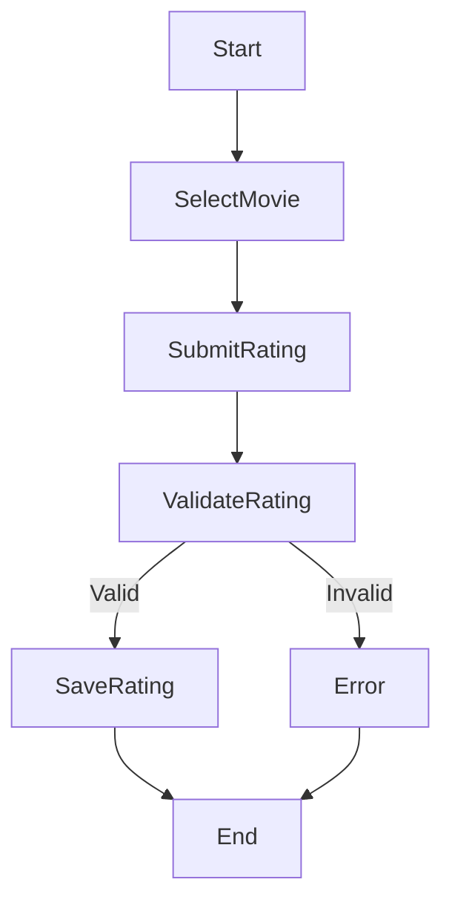
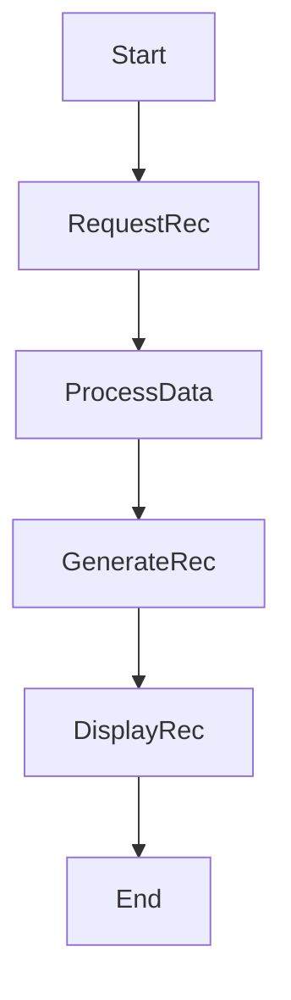
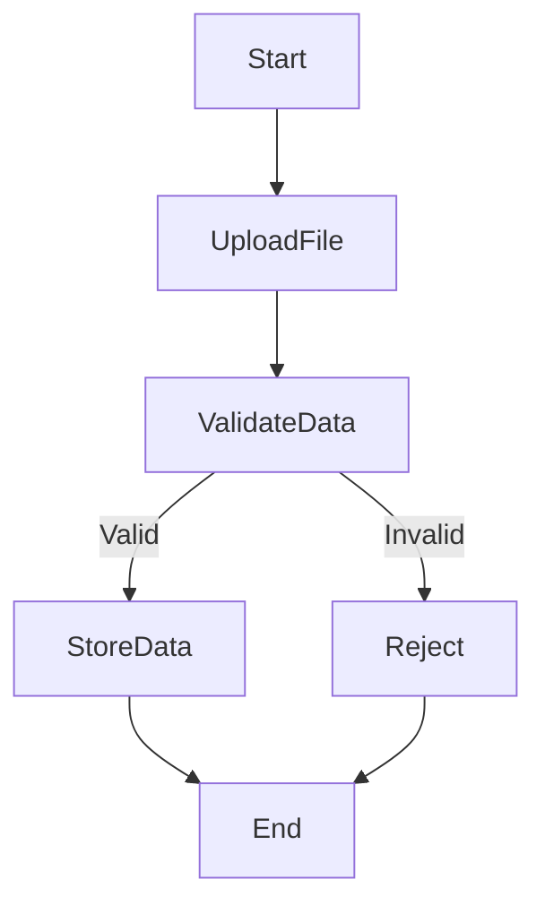
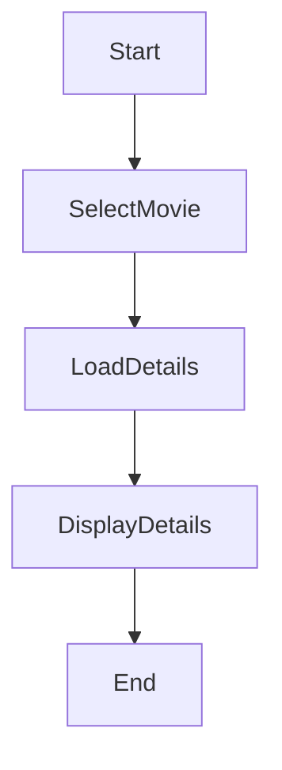
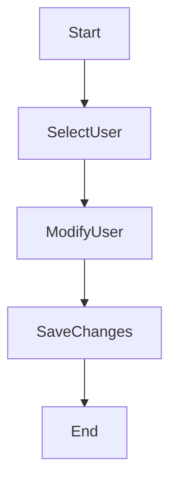
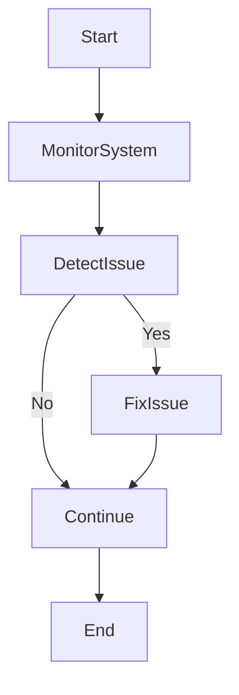

# Activity Diagrams For a Movie Recommendation System

---

## 1. User Login Workflow: Handles authentication (FR1, US-001).

---

## Search Movies Workflow: Supports movie discovery (FR2, US-002).

---

## Rate Movie Workflow: 

---

## Recommendation Workflow

---

## Import Dataset Workflow

---

## View Movie Details

---

## Manage Users Workflow

---

## System Monitoring Workflow

---