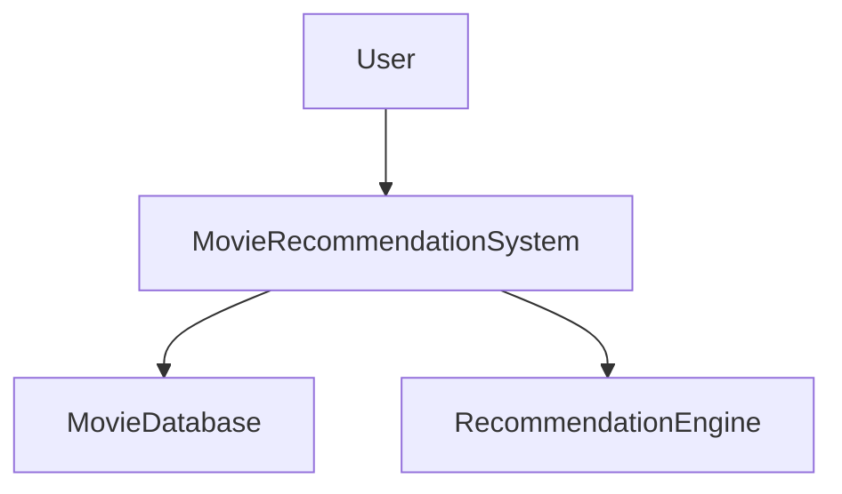
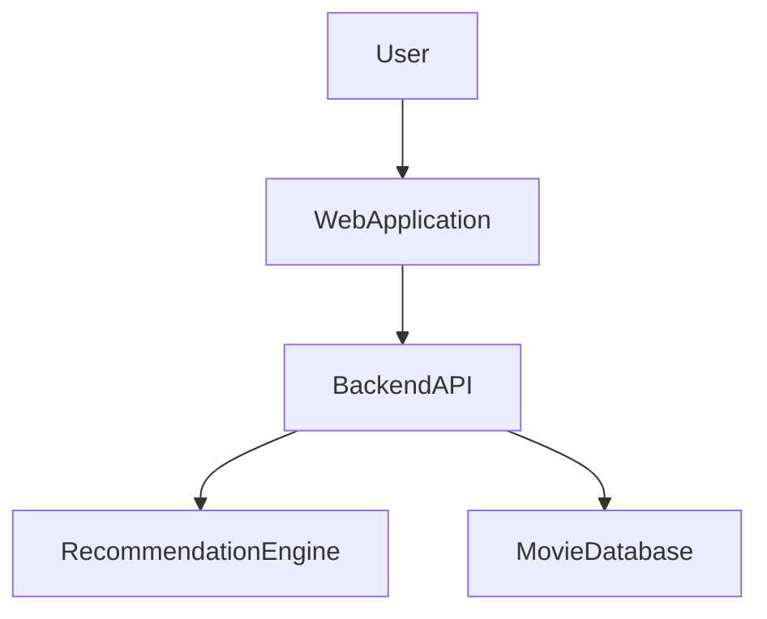
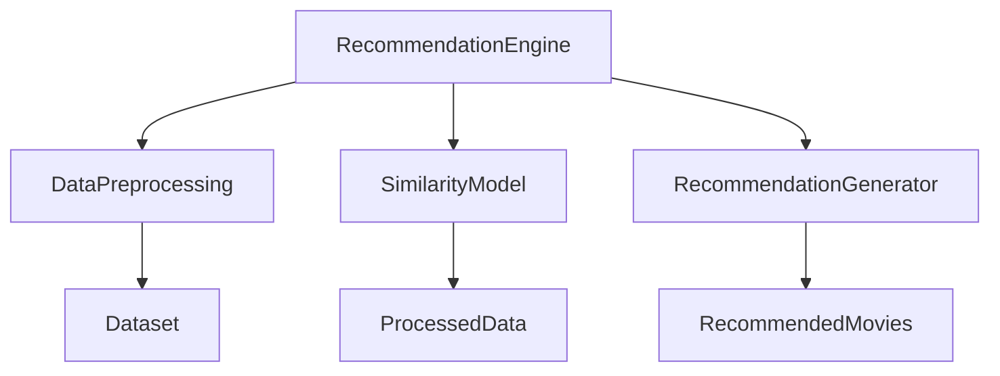

# Movie Recommendation System Architecture

## Project Title

Movie Recommendation System

## Domain

Data Science and Entertainment Technology

## Problem Statement

Users often struggle to find movies that match their preferences because of the large number of available movies.

## Individual Scope

The system will focus on building a recommendation engine using movie datasets and generating personalized movie recommendations.

---

## C4 Level 1: System Context Diagram

---

## C4 Level 2: Container Diagram

---

## C4 Level 3: Component Diagram

