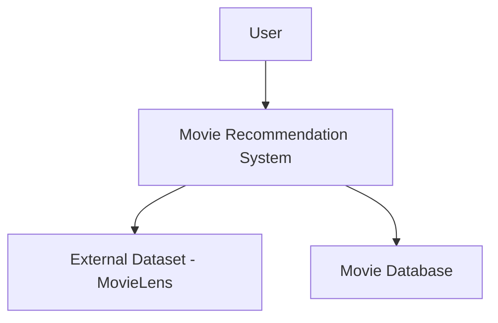
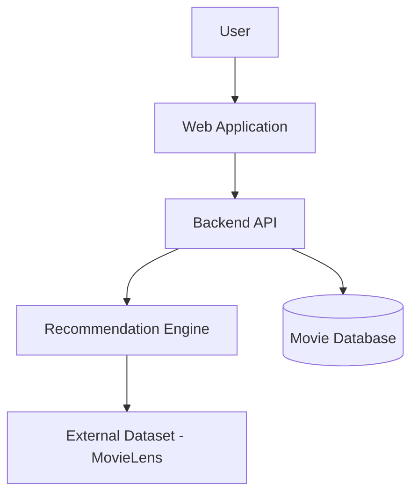
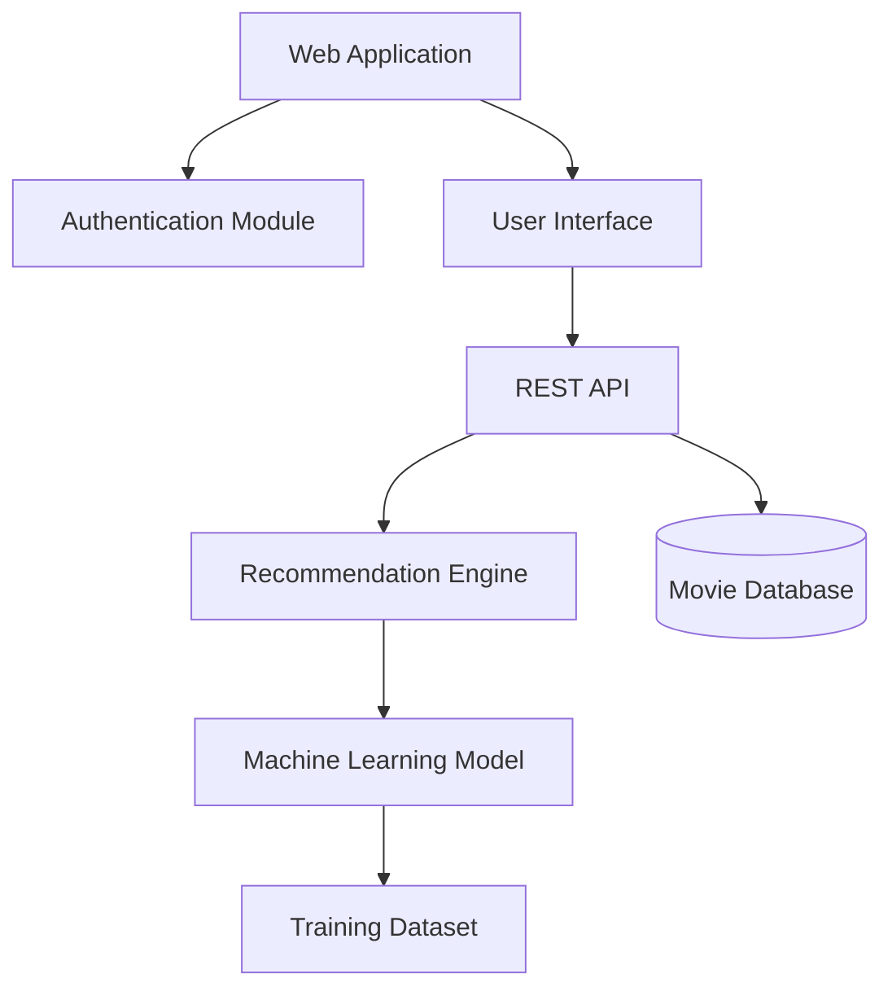

# Movie Recommendation System Architecture

## Project Title
Movie Recommendation System

## Domain
Data Science and Entertainment Technology

## Problem Statement
Users struggle to discover movies that match their preferences because of the large number of available options.

This system analyzes user ratings and movie metadata to generate personalized recommendations.

## Individual Scope
The project implements a simplified recommendation system including data processing, machine learning model, and a basic user interface.

---

# C4 Model Diagrams

## C4 Level 1: System Context Diagram

---

## C4 Level 2: Container Diagram

---

## C4 Level 3: Component Diagram

---

# End-to-End System Components

The system contains the following components working together:

### User Interface
Allows users to search for movies and view personalized recommendations.

### Authentication Module
Handles user registration and login.

### Backend API
Processes user requests and connects the interface to the system components.

### Recommendation Engine
Generates personalized movie suggestions based on user ratings and preferences.

### Machine Learning Model
Learns patterns from movie rating datasets to improve recommendations.

### Movie Database
Stores movie details, ratings, and user profiles.

### Dataset Source
Provides movie data used to train the recommendation system.