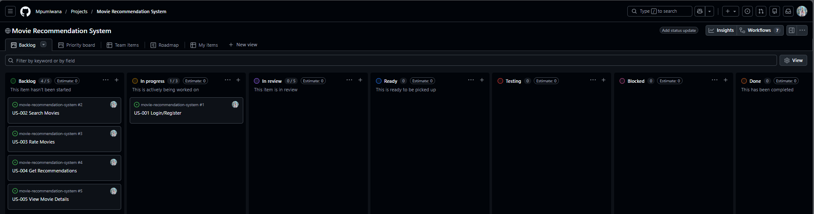

# Kanban Board — Movie Recommendation System

## Kanban Board Screenshot

## Explanation

The Kanban board was created using the Automated Kanban template in GitHub Projects.

Custom columns added:

- Testing → to ensure quality before completion  
- Blocked → to track tasks that cannot proceed  

Tasks were added from Assignment 6 and linked as GitHub Issues. Each issue was assigned and moved across columns to simulate real Agile workflow.

The board shows task progression from Backlog → Ready → In Progress → In Review → Testing → Done, demonstrating a complete development lifecycle. The Blocked column was also used to represent tasks that are waiting for dependencies, such as dataset availability.
