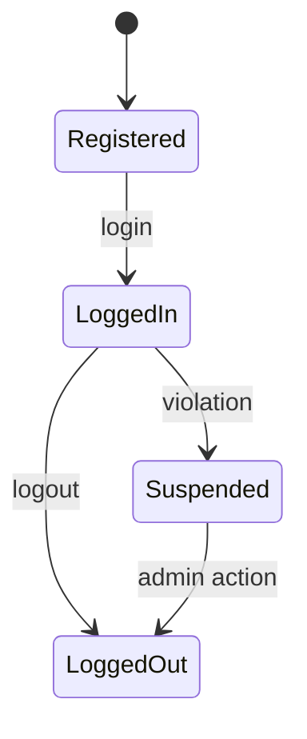
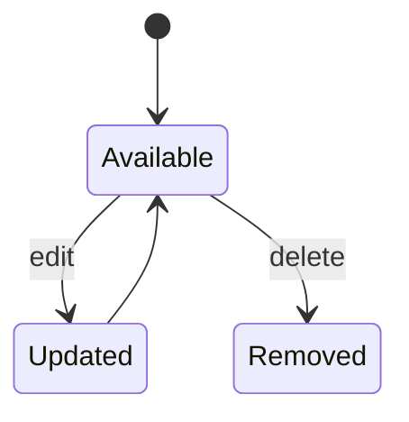
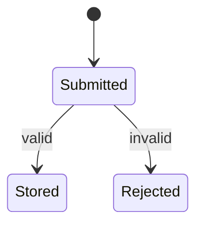
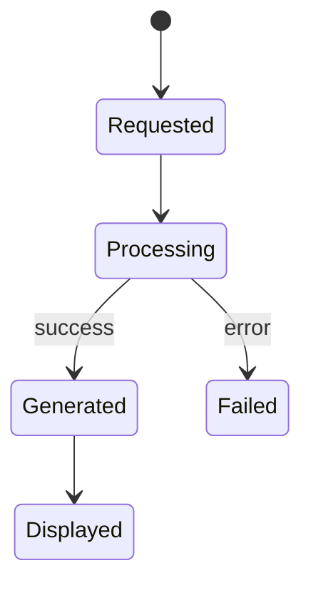
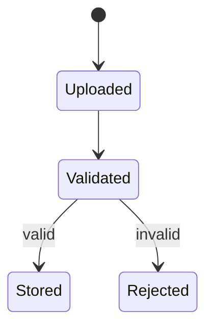
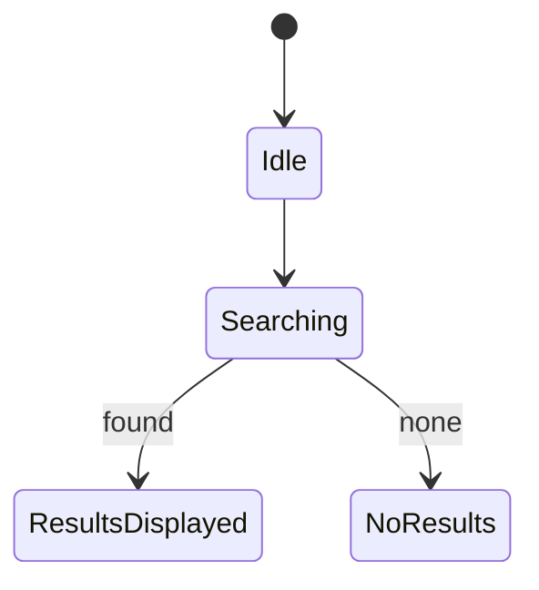
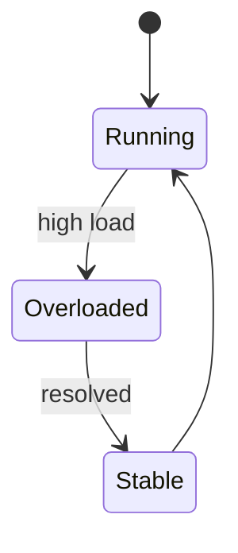

# State Transition Diagrams For a Movie Recommendation System

---

## 1. User Account State

---

## Movies can be updated or removed from the system.

---

## Ratings are validated before being stored.

---

## Recommendations are processed and shown to the user.

---

## Datasets are validated before being stored.

---

## Search either returns results or none.

---

## System handles load and returns to stable state.

---